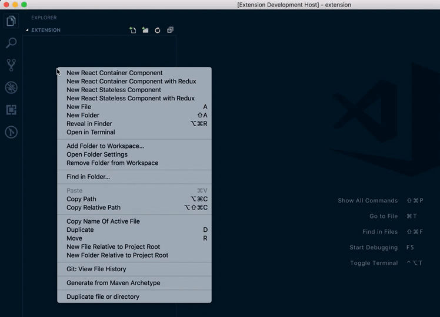
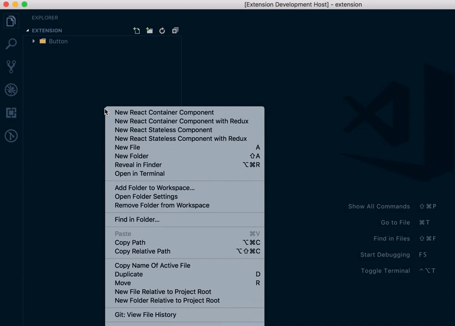
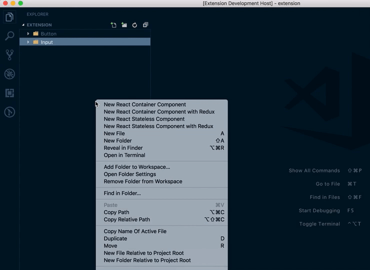

# React Component Generation Extension for VSCode
(**vscode-react-component-generator**)

[](https://marketplace.visualstudio.com/items?itemName=abdullahceylan.vscode-react-component-generator)
[](https://marketplace.visualstudio.com/items?itemName=abdullahceylan.vscode-react-component-generator)
[](http://opensource.org/licenses/MIT)
[](https://github.com/abdullahceylan/vscode-react-component-generator/releases)

## Description
The extension automatically creates folder for react component containing :
- `index.js`
- `ComponentName.jsx`
- `ComponentName.styles.js` (for `styled`-component or `emotion` option)
- `ComponentName.css` (for `standard` style option)

## Usage

- Right click on the file or folder in the file explorer
- Select one of following options:
    - "New React Container Component"
    - "New React Stateless Component"
    - "New React Container Component with Redux"
    - "New React Stateless Component with Redux"
- Enter a component name in the pop up in camelCase or PascalCase. If you enter the component name as in camelCase, then extension will convert it PascalCase automatically.







## Configuration
You can access to the extension's settings through VSCode settings. You can customize:

- **global** (`object`):
    - **quotes** (string) - Options: `single` or `double` Result: `'`  or  `"`
    - **generateFolder** (`bool`) - generate or not separate folder for newly created component
- **create** (`bool`) - weather to generate this file or not
- **type** (`string`) - only for `style` file. Options: `standard`, `styled` or `emotion`
- **suffix** (`string`) - only for `style` file and it's optional. When you specified a suffix, style file name will be ComponentName`suffix`.`extension` Default: `.styles`
- **extension** (`string`) - extension of generated file (e.g. you might want to change stylesheet file extension of styles, replace "js" with just plain "css")

```json
{
    "global": {
        "quotes": "single",
        "generateFolder": true,
    },
    "files": {
        "component": {
            "create": true,
            "extension": "jsx",
        },
        "style": {
            "create": true,
            "type": "styled",
            "suffix": ".styles",
            "extension": "js"
        },
        "index": {
            "create": true,
            "extension": "js"
        }
    }
}
```
### Changelog
#### 0.0.1 (2018-12-02)
- Initial release

## Bugs

Please report [here](https://github.com/abdullahceylan/vscode-react-component-generator/issues)
