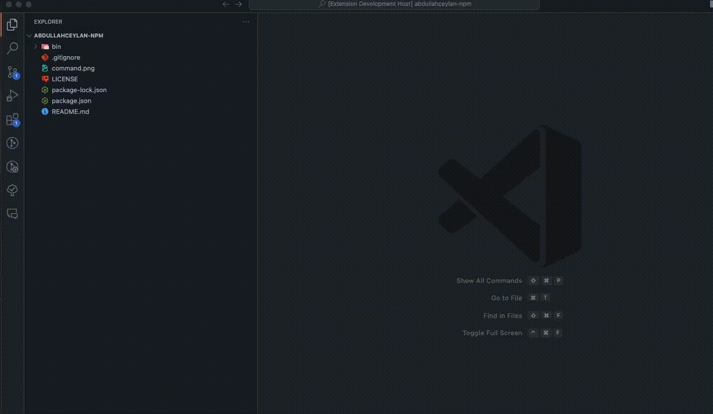
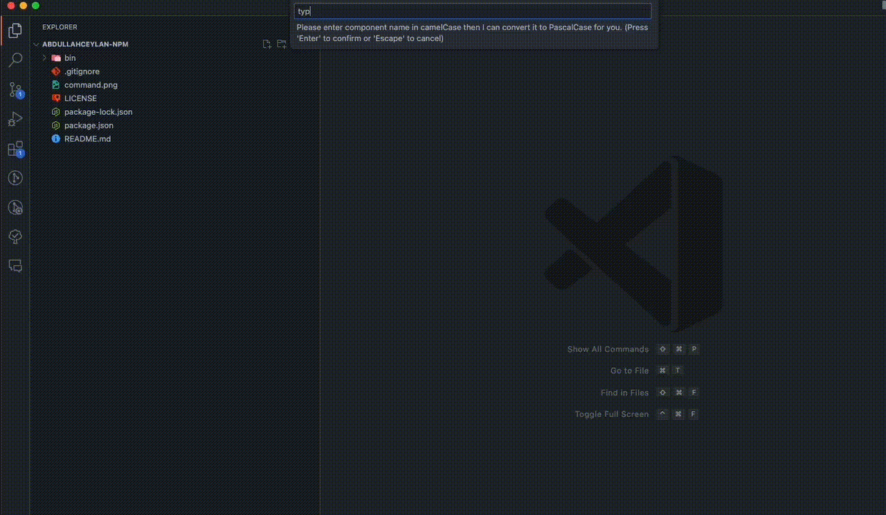
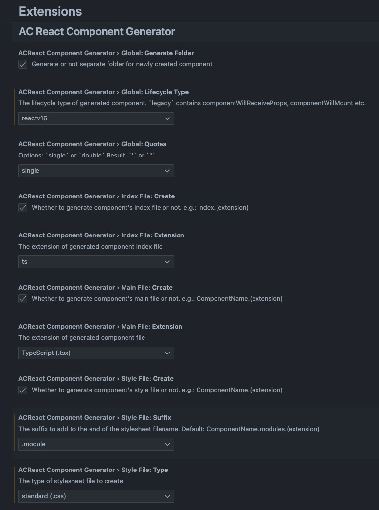

# React Component Generator Extension for VSCode

The extension helps you to create a React component with one-click. There are also options to create Remix and TypeScript React components.

[](https://marketplace.visualstudio.com/items?itemName=abdullahceylan.vscode-react-component-generator)
[](https://marketplace.visualstudio.com/items?itemName=abdullahceylan.vscode-react-component-generator)
[](https://marketplace.visualstudio.com/items?itemName=abdullahceylan.vscode-react-component-generator)
[](http://opensource.org/licenses/MIT)

## Other Versions
[Please click here for React Native version](https://marketplace.visualstudio.com/items?itemName=abdullahceylan.vscode-react-native-component-generator)

## Description

The extension automatically creates folder for react component containing :

- `index.(js|ts)`
- `ComponentName.(jsx|tsx)`
- `ComponentName.styles.(js|ts)` (for `styled`-component or `emotion` option)
- `ComponentName.css` (for `standard` style option)
- `ComponentName.module.css` (you'll need to set prefix from the extension settings)
- `ComponentName.scss` (for `sass` style option)
- `ComponentName.less` (for `less` style option)

## Installation

Install through VS Code extensions. Search for `VSCode React Component Generator`

[Visual Studio Code Market Place: VSCode React Component Generator](https://marketplace.visualstudio.com/items?itemName=abdullahceylan.vscode-react-component-generator)

Can also be installed in VS Code: Launch VS Code Quick Open (Ctrl+P), paste the following command, and press enter.

```bash
ext install abdullahceylan.vscode-react-component-generator
```

## Usage

- Right click on the file or folder in the file explorer
- Select one of following options:
  - "New React Stateless Component"
  - "New React Stateless Component with Redux"
  - "New React TypeScript Component"
  - "New React TypeScript Remix Component"
  - "New React TypeScript Remix Route Component"

- Enter a component name in the pop up in camelCase or PascalCase. If you enter the component name as in camelCase, then extension will convert it PascalCase automatically.

- For Remix Route component, enter the route file name and the file will be created with `app.` prefix. i.e.:
  - demoRoute -> app.demo.route.ts
  - demoRouteChild -> app.demo.route.child.ts

### Creating a React Component



### Creating a TypeScript React Component, Remix TypeScript Component and React TypeScript Route Component






## Configuration

You can access to the extension's settings through VSCode settings. You can customize:

### `ACReactComponentGenerator.global.generateFolder` (default: `true`)

Generate or not separate folder for newly created component

### `ACReactComponentGenerator.global.quotes` (default: `single`)

Controls the quotes for the imports in the files. Valid options:

- "single" - e.g.: import React from `'`react`'`
- "double"  - e.g.: import React from `"`react`"`

### `ACReactComponentGenerator.global.lifecycleType` (default: `legacy`)

The lifecycle type of generated component. Valid options:

- "legacy" - Contains `componentWillReceiveProps`, `componentWillMount`
- "reactv16"  - Contains `getSnapshotBeforeUpdate`, `getDerivedStateFromProps`, `getDerivedStateFromError`, `componentDidCatch` and removes `componentWillReceiveProps` and `componentWillMount`

### `ACReactComponentGenerator.indexFile.create` (default: `true`)

Whether to generate component's index file or not.

### `ACReactComponentGenerator.indexFile.extension` (default: `ts`)

The extension of generated component index file. e.g.: index.(`extension`)

### `ACReactComponentGenerator.mainFile.create` (default: `true`)

Whether to generate component's main file or not.

### `ACReactComponentGenerator.mainFile.extension` (default: `tsx`)

The extension of generated component file. e.g.: ComponentName.(`extension`)

### `ACReactComponentGenerator.styleFile.create` (default: `true`)

Whether to generate component's stylesheet file or not.

### `ACReactComponentGenerator.styleFile.extension` (default: `css`)

The extension of generated stylesheet file. e.g.: ComponentName.styles.(`extension`)

### `ACReactComponentGenerator.styleFile.suffix` (default: `none`)

The suffix to add to the end of the stylesheet filename. Default: None
You have option to select `CSS modules` and `Styled Component`

### `ACReactComponentGenerator.styleFile.type` (default: `styled-components`)

The type of stylesheet file to create. Valid options:

- "standard (.css)" - ComponentName.`css` (You can use this for CSS modules as well)
- "styled-components/emotion (.js)" - ComponentName.styles.`js`
- "standard (.css)" - ComponentName.styles.`css`
- "sass (.scss)" - ComponentName.styles.`sass`
- "less (.less)" - ComponentName.styles.`less`

## Changelog

### [Click here](CHANGELOG.md)

## Bugs

Please report [here](https://github.com/abdullahceylan/vscode-react-component-generator/issues)
